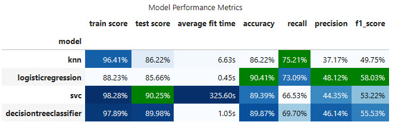
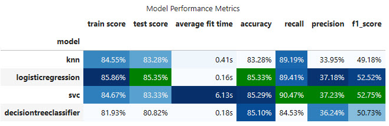
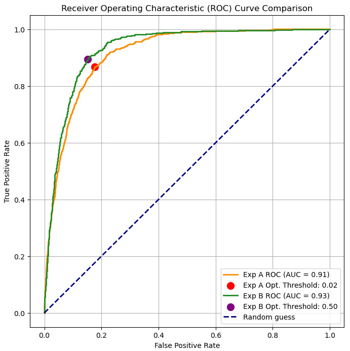
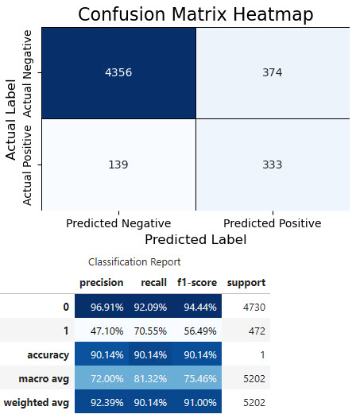

# Call Center Marketing Campaign for a Bank in Portugal

## Overview: 
In this practical application, the goal is to compare the performance of the classifiers performances, namely K Nearest Neighbor, Logistic Regression, Decision Trees, and Support Vector Machines.  I will utilize a dataset related to marketing bank products over the telephone.  
##
### Dataset source location and context description:
The dataset comes from the UCI Machine Learning repository [link](https://archive.ics.uci.edu/ml/datasets/bank+marketing).  The data is from a Portugese banking institution and is a collection of the results of multiple marketing campaigns during a two years period.
##
### Dataset details:
This marketing dataset is related to 17 marketing campaigns that occurred between May 2008 and November 2010, run by a Portuguese bank that used its own contact-center to do directed marketing campaigns for a long-term deposit application with good interest rates.

**Input variables:**

*Bank client data:*

- age: (numeric)

- job: type of job (categorical: "admin.","unknown","unemployed","management","housemaid","entrepreneur","student","blue-collar","self-employed","retired","technician","services")

- marital: marital status (categorical: "married","divorced","single"; note: "divorced" means divorced or widowed)

- education: (categorical: "unknown","secondary","primary","tertiary")

- default: has credit in default? (binary: "yes","no")

- balance: average yearly balance, in euros (numeric)

- housing: has housing loan? (binary: "yes","no")

- loan: has personal loan? (binary: "yes","no")

*Related to the last contact of the current campaign:*

- contact: contact communication type (categorical: "unknown","telephone","cellular")

- day: last contact day of the month (numeric)

- month: last contact month of year (categorical: "jan", "feb", "mar", ..., "nov", "dec")

- duration: last contact duration, in seconds (numeric)

*Other attributes:*

- campaign: number of contacts performed during this campaign and for this client (numeric, includes last contact)

- pdays: number of days that passed by after the client was last contacted from a previous campaign (numeric, -1 means client was not previously contacted)

- previous: number of contacts performed before this campaign and for this client (numeric)

- poutcome: outcome of the previous marketing campaign (categorical: "unknown","other","failure","success")

**Output variable (desired target):**

- y: has the client subscribed a term deposit? (binary: "yes","no")
  
##
## Access the notebook file here: --->>> [Jupyter Notebook file](PA17_1.ipynb)

 

## **Overall technical findings**

  For these experiments using accuracy as key evaluation metric is very misleading and not recommended. This is because of the very unbalanced data set (90% for the majority class). 
  
  In the given business context, identification of bank's clients that would accept a marketing campaing promotion (in this case a good interest rate deposit), the most important evaluation metrics are Precision, Recall and F1-Score overall. However, an even more important metric are Precision, Recall and F1-Score the context of the minority class 1 (which in this case is the accepted promotion). 
  
  Considering the above, the experiments were designed to optimise(increase) F1-Score, which is a better metric for unbalanced dataset because is representing the optimal point between precision and recall metrics. 

- **Models selection and optimization techniques** considered two stages:
  1. Selecting the best model using **GridSearch** and adjusting the hyperparameters for the best F1-score
  2. Finding the **optimal probability threeshold** for each model and comparing the results for **F1-Score maximization**
- **Techniques used to deal with unbalanced nature of the dataset** and its size in Experiment A:
   - **Oversampling** using SMOTE
   - **UnderSampling** using: RandomUnderSampler, NearMiss-version1, EditedNearestNeighbours
   - **class_weight='balanced'** for all models where applicable
   - **Adjustable dataset sampling for SVM** which is the most cumputational expenside model (started with smaller test samples to run more kernels and after selecting the best kernel by increased the test sample.
     
- During the experimentation I've concluded that **oversampling the minority class created a better dataset than undersampling the majority class**. The results are showing that all models perform better on the oversampled dataset.
  
- This is clearly observed by comparing the F1-Score, Precision and Recall metrics for both experiments. I have used Confusion Matrix, and Classification Report for a deeper dive into the performance of each model.
 
- The **best model from Experiment-A and also overall** is: **LogisticRegression Model** with below results:

 

  

 

  - The best models for Experiment-B is: **Support Vector Machine (SVM)** with below results. However these rezults are below the results obtained in Experiment-A:

 

  

 

- For each models (where reasonable possible) I've also extracted the most relevant features:

- In both experiments I've managed to get a pretty good **ROC of 0.93 for Experiment-B** and **ROC of 0.91 for Experiment-A**.

Nevertheless, ROC for Experiment-B is slighly better but only because the optimization was performed for F1-Score and not ROC. However ROCs, confirm that boht experiments show good results.

 

  

 

- Nest step is to try new more powerfull models to further improve metrics and the overall F1-Score

## **Business related findings and recommendations:**

The selected model should help the bank to choose the correct list of clients to be included in a new marketing campaign. The should be efficient and maximize its Return on Investment (ROI). The campaing will promote a new product (bank deposit with promotional rates) and the success should be measured by the number of clients that created new deposits as the result of the marketing campaign.

**Scenario-1:** - *Marketing campaign with cost optimization*

With the **selected Logistic Regression model** if the bank intend to launch a very targeted campaing while keeping the campaing cost optimal, then with this model they should be able to **identify a list of clients that should be targeted by the new promotion campaign**. 

The model predict that **45.5% of the clients in this list will accept the promotion!**
This will represent **60.59%** of the total number of all clients in the database that would accept the promotion.
This is explained by below Classification Reports that shown the **Precision** and **Recall** as **%** for the **Class 1 (Clients that would accept the promotion)**:
 

  

 

**Scenario-2:** - *Marketing campaign that maximizes the promotion adoption over campaign cost*

If the bank is not very concerned with the overall campaign cost and want to **maximize the total number of clients that will accept the promotion**, then they can use the model to select from bank database all clients that should not be part of the campaing. 

This will allow the bank to exclude from the campaing the clients that would not take the promotion anyway. This approach will help the bank to filter out with an high accuracy (probability of **95.95%**) all clients that would not accept the promotion. 

In this scenario the bank will have a bigger list of clients to be targeted by the marketing campaign, than in the first scenario. In this list the percentaee of clients that will accept the promotion is significantly higher than **45.5%** specific to scenario 1. 
In this case the bank would miss only **5%** of the total clients that are in the database, but not part of the campaing.
##
## **Next step to improve the results:**

- Nest step is to try new more powerfull models to further improve F1-Score
